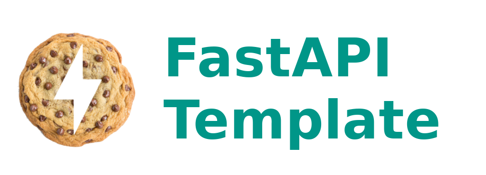

<i>Template for FastAPI contains many features</i>

<!-- TABLE OF CONTENTS -->

  
Table of Contents

  <ol>
    <li>
      <a href="#about-the-project">About The Project</a>
      <ul>
        <li><a href="#built-with">Built With</a></li>
      </ul>
    </li>
    <!-- <li>
      <a href="#getting-started">Getting Started</a>
      <ul>
        <li><a href="#prerequisites">Prerequisites</a></li>
        <li><a href="#installation">Installation</a></li>
      </ul>
    </li> -->
    <!-- <li><a href="#usage">Usage</a></li> -->
    <li><a href="#roadmap">Roadmap</a></li>
    <!-- <li><a href="#contributing">Contributing</a></li> -->
    <li><a href="#license">License</a></li>
    <!-- <li><a href="#contact">Contact</a></li> -->
    <!-- <li><a href="#acknowledgments">Acknowledgments</a></li> -->
  </ol>

## About The Project

I want to create a template for start new project easily and over time complete this project and update and upgrade it.
I will be happy if you can help me in this direction.

(<a href="#readme-top">back to top</a>)

### Built With

This section lists every major framework/library used in the project:

* Python
* FastAPI
* MongoDB
* Redis

(<a href="#readme-top">back to top</a>)

<!-- ROADMAP -->
## Roadmap

- [ ] Create structure folders and files
- [ ] Connection to databases
- [ ] Add authentication with jwt
- [ ] Add route login
- [ ] Add basic RBAC (Role base access control)
- [ ] Add route for edit profile
- [ ] Add route create account for user role
- [ ] Add route manage users for admin role
- [ ] Add Pagination
- [ ] Add some template routes for all methods
- [ ] Add sample to upload files and save it on mongo
- [ ] Add docker files

(<a href="#readme-top">back to top</a>)

<!-- LICENSE -->
## License

Distributed under the MIT License. See `LICENSE.txt` for more information.

(<a href="#readme-top">back to top</a>)

<!-- CONTACT -->
## Contact

Email: smmhosseini.shahed@gmail.com
Telegram: https:/t.me/sedmehdihosseini

<!-- Project Link: [https://github.com/your_username/repo_name](https://github.com/your_username/repo_name) -->

(<a href="#readme-top">back to top</a>)

